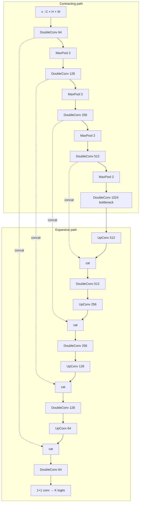

# Schematics

Two drawings, generated by `scripts/render_schematic.py` (plain SVG, labels
are exact — not an image-model rendering).

| File | What it is |
|------|------------|
| [schematics/unet_canonical.svg](schematics/unet_canonical.svg) | The U. Paper spatial sizes and channel counts. |
| [schematics/unet_pipeline.svg](schematics/unet_pipeline.svg) | How you actually train and infer, 2015 vs nnU-Net. |

Re-render:

```
python scripts/render_schematic.py
```

## Architecture (canonical)

Open `schematics/unet_canonical.svg`. Reading left to right / down then up:

1. Gray **in** tile, 572×572 × C.
2. Blue **encoder** stairs. Each step pools and doubles channels.
   Sizes after the two valid 3×3 convs: 568²/64, 280²/128, 136²/256, 64²/512.
3. Purple **bottleneck** 28²/1024.
4. Green **decoder** stairs. Each step up-convs, concatenates the skip,
   then two 3×3. Sizes: 52²/512, 100²/256, 196²/128, 388²/64.
5. Red **1×1** head → K logits at 388×388.
6. Orange dashed **skips**: copy, center-crop, concatenate. Not add.

Modern training mode is the same boxes with `pad=1`, so a 256² input stays
256² all the way through and the bottleneck is 16².

## Data flow (one forward pass)



## Where a later formula is allowed to land

To stay an equivalent U-Net, keep the **graph** (contract / bottleneck /
expand / skip / per-pixel head). Replace one or more **operators**:

| Box on the schematic | Current operator | Legitimate replacement |
|----------------------|------------------|------------------------|
| DoubleConv | two 3×3 + ReLU | another local mixer of the same rank |
| MaxPool | 2×2 max, stride 2 | any 2× downsample (stride conv, blur-pool, learned) |
| UpConv | 2×2 transposed conv | any 2× upsample |
| concat skip | channel concat | other fusion, **if** you re-measure boundary Dice |
| wCE / Dice+CE | see mathematics doc | another pixel/set loss on the same masks |
| 1×1 head | linear class projection | any map to K logits |

Changing the graph (no skips, no decoder, global token mixer with no
spatial recovery) is a different model. It can still be compared on the
scoreboard; it is not a U-Net equivalent.

## Pipeline schematic

Open `schematics/unet_pipeline.svg`.

- **Top row:** 2015. Elastic augment → one tile → weighted CE → SGD 0.99 →
  overlap-tile + mirror → IOU / warping / Rand.
- **Bottom row:** nnU-Net. Dataset fingerprint → auto patch/pools/2D-or-3D →
  Dice+CE, poly LR, deep supervision → sliding window + TTA + 5-fold →
  optional connected-component cleanup → mean foreground Dice.

The comparison loop in this repo is the top row’s net with the bottom row’s
loss (Dice+CE), unless we are specifically reproducing Table 1/2 of the paper.
